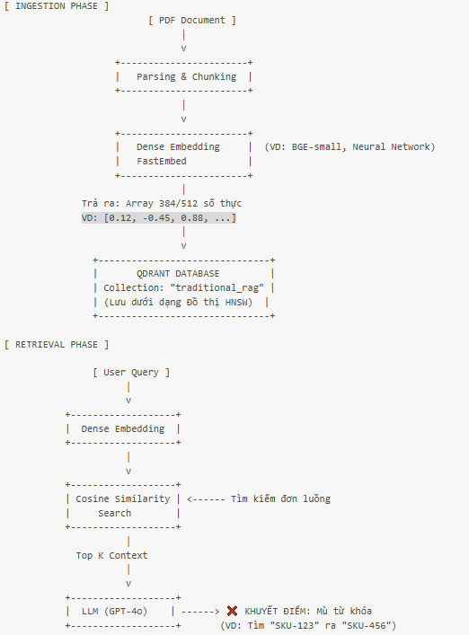
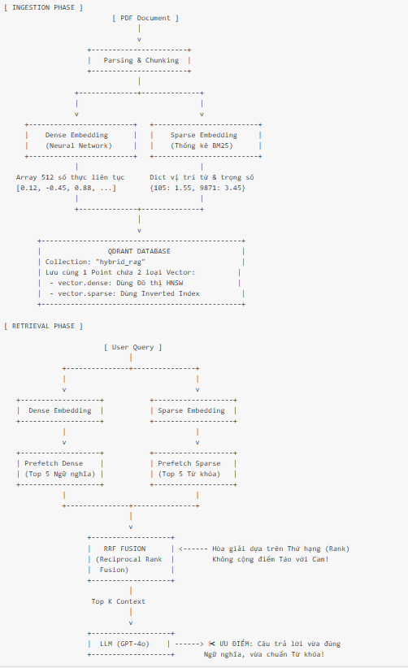
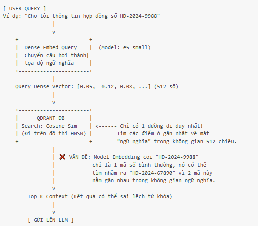
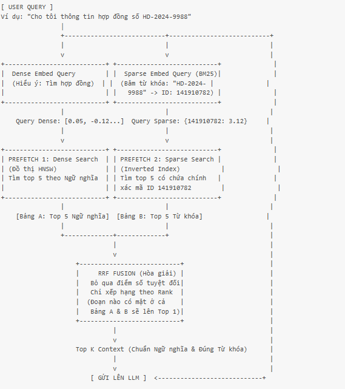
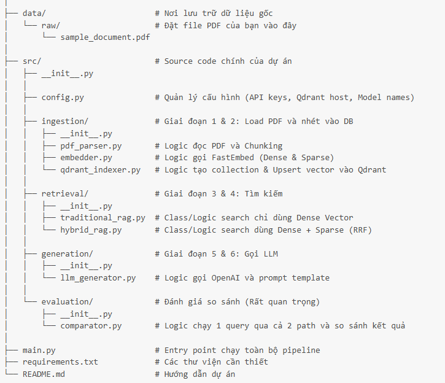

# So sánh Traditional RAG và Hybrid RAG

Dự án này thực hiện cài đặt và so sánh hai phương pháp Retrieval-Augmented Generation (RAG): **Traditional RAG** (chỉ sử dụng Semantic Search) và **Hybrid RAG** (kết hợp Semantic Search và Keyword Search).

## 1. Lý thuyết: Traditional RAG vs Hybrid RAG

### Traditional RAG (Semantic Search)
Traditional RAG dựa chủ yếu vào tìm kiếm ngữ nghĩa (Semantic Search) sử dụng **Dense Vectors**.
- **Cách hoạt động:** Dữ liệu văn bản được đưa qua một mô hình nhúng (Embedding Model) để tạo ra các vector mang mật độ cao (Dense Vectors) chứa thông tin về mặt ngữ nghĩa. Khi người dùng đặt câu hỏi, câu hỏi cũng được chuyển thành vector tương tự. Hệ thống sẽ tính toán khoảng cách (như Cosine Similarity) giữa vector câu hỏi và các vector tài liệu để tìm ra các tài liệu có ý nghĩa gần nhất.
- **Ưu điểm:** Hiểu được ngữ cảnh và sự đồng nghĩa. Ngay cả khi câu hỏi không chứa từ khóa chính xác trong tài liệu, hệ thống vẫn có thể tìm được thông tin dựa trên ý nghĩa.
- **Nhược điểm:** Thường kém hiệu quả khi tìm kiếm các từ khóa chính xác, mã số, tên riêng, hoặc các từ viết tắt chuyên ngành. Nó có thể trả về các văn bản "có vẻ liên quan" nhưng lại thiếu đi thông tin chính xác mà người dùng cần.

### Hybrid RAG
Hybrid RAG kết hợp điểm mạnh của cả tìm kiếm ngữ nghĩa (Dense Vectors) và tìm kiếm từ khóa (Sparse Vectors - ví dụ: BM25).
- **Cách hoạt động:** 
  - **Quá trình nạp dữ liệu:** Hệ thống nhúng văn bản thành cả Dense Vectors (để bắt ngữ nghĩa) và Sparse Vectors (để đếm tần suất từ khóa, chú trọng vào các từ vựng đặc trưng).
  - **Quá trình truy vấn:** Khi có câu hỏi, hệ thống thực hiện cả tìm kiếm ngữ nghĩa và tìm kiếm từ khóa đồng thời trên cơ sở dữ liệu vector.
  - **Kết hợp (Fusion):** Kết quả từ hai phương pháp này sau đó được kết hợp lại sử dụng các thuật toán như **Reciprocal Rank Fusion (RRF)**. RRF giúp xếp hạng lại (re-rank) và đưa ra danh sách kết quả cuối cùng cân bằng được cả hai yếu tố.
- **Ưu điểm:** Khắc phục triệt để nhược điểm của Traditional RAG. Vừa hiểu được ngữ nghĩa phức tạp, vừa tìm kiếm cực kỳ chính xác các mã số, tên riêng, từ viết tắt (ví dụ: "ĐHĐCĐ 2023", mã cổ phiếu, v.v.).

## 2. Luồng hoạt động (Workflow)

### Quá trình Ingestion (Nạp dữ liệu)
Cả hai phương pháp đều bắt đầu bằng việc đọc file PDF và chia nhỏ thành các đoạn (chunking).

- **Traditional RAG:** Tạo Dense Vector cho mỗi chunk và lưu vào Qdrant (collection `traditional_rag`).
  
  

- **Hybrid RAG:** Tạo CẢ Dense Vector và Sparse Vector (BM25) cho mỗi chunk, sau đó lưu cả hai vào Qdrant (collection `hybrid_rag`).
  
  

### Quá trình Retrieval (Truy xuất)

- **Traditional RAG:** Nhúng câu hỏi thành Dense Vector và tìm kiếm các vector tương đồng nhất thông qua khoảng cách Cosine/Dot Product.
  
  

- **Hybrid RAG:** Nhúng câu hỏi thành CẢ Dense và Sparse Vector. Sử dụng tính năng `FusionQuery` của Qdrant kết hợp với thuật toán `RRF` để lấy và xếp hạng kết quả chung từ cả hai nhánh tìm kiếm.
  
  

## 3. Cấu trúc dự án

Dự án được tổ chức rõ ràng theo từng giai đoạn của một pipeline RAG:



- `src/config.py`: File cấu hình chung cho dự án (đường dẫn, tên mô hình, cấu hình DB).
- `src/ingestion/`: Logic tiền xử lý dữ liệu.
  - `pdf_parser.py`: Đọc file PDF và cắt thành các chunk nhỏ.
  - `embedder.py`: Tải các mô hình `fastembed` (Dense: `bge-small-zh-v1.5`, Sparse: `bm25`) để thực hiện embedding văn bản.
  - `qdrant_indexer.py`: Khởi tạo collection và đẩy (upsert) vector vào cơ sở dữ liệu Qdrant.
- `src/retrieval/`: Chứa logic tìm kiếm cho cả `traditional_rag.py` và `hybrid_rag.py`.
- `src/evaluation/`: Logic để so sánh kết quả trả về của 2 phương pháp với các câu hỏi test khác nhau.
- `data/raw/`: Thư mục lưu trữ file tài liệu PDF đầu vào.

## 4. Hướng dẫn khởi chạy

### Yêu cầu hệ thống
- Python 3.9 trở lên
- Docker (dùng để chạy Qdrant Vector Database)

### Bước 1: Cài đặt thư viện phụ thuộc
Mở terminal tại thư mục gốc của dự án và chạy:
```bash
pip install -r requirements.txt
```

### Bước 2: Khởi chạy Qdrant
Dự án sử dụng Qdrant làm cơ sở dữ liệu vector lưu trữ cả Dense và Sparse vectors. Hãy khởi chạy Qdrant qua Docker bằng lệnh:
```bash
docker run -p 6333:6333 -p 6334:6334 qdrant/qdrant:latest
```

### Bước 3: Chuẩn bị dữ liệu và biến môi trường
1. Tạo file PDF mà bạn muốn thử nghiệm, đổi tên thành `sample_document.pdf` và đặt vào trong thư mục `data/raw/`. (Nếu bạn muốn dùng tên khác, hãy cập nhật lại biến `PDF_FILE_PATH` trong file `src/config.py`).
2. Tạo một file tên là `.env` ở thư mục gốc của dự án và điền API Key OpenAI của bạn vào:
```env
OPENAI_API_KEY=your-openai-api-key-here
```
*(API Key này được dự án sử dụng cho các LLM nếu có bước tổng hợp và sinh câu trả lời tự động).*

### Bước 4: Chạy dự án và xem so sánh
Thực thi lệnh sau:
```bash
python main.py
```

**Quá trình chương trình hoạt động:**
1. Kiểm tra tài liệu PDF có tồn tại hay không, sau đó Parse và Chunk tài liệu.
2. Tự động tải mô hình Embedding (`BAAI/bge-small-zh-v1.5` cho ngữ nghĩa và `Qdrant/bm25` cho từ khóa) vào thư mục `models_cache/` nội bộ.
3. Nhúng (embed) dữ liệu và Indexing vào 2 collection của Qdrant.
4. Chạy bộ câu hỏi kiểm tra tích hợp sẵn. Bạn sẽ thấy rõ rằng các câu hỏi chứa **tên riêng, mã chuyên ngành** thì Hybrid RAG sẽ truy xuất tốt hơn rất nhiều so với Traditional RAG.